Introduction
•	The keyword in Data Science is not Data, it is Science.
•	Businesses today are accumulating new data at a rate that exceeds their capacity to extract value from it. The question being faced by every organization is, how can data be used effectively – not just their own data, but all of the data that is available and relevant.
•	Data Science is emerging at the intersection of fields of Probability & Statistics, Machine Learning, Computer Science and Mathematics. This specialized field demands multiple skills not easy to obtain through conventional curricula. 

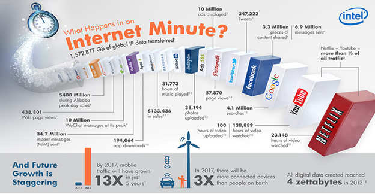

Digital data

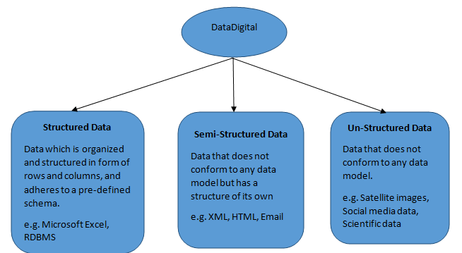

Methodical Alignment of Data points:

What is Data Science?
Data Science, a cross-functional discipline, is about scientific exploration of data to extract meaning or insight, and the construction of software systems to utilize such insights in a business or social context.

Components of Data Science

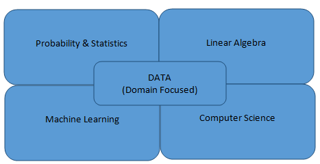

•	Apart from these, Domain knowledge must be acquired in order to apply Data Science effectively.

Probability:

Probability is the branch of mathematics that deals with calculating the likelihood of a given event’s occurrence. It is expressed as a number between 0 and 1.
An event with a probability of 1 can be considered a certainty. An event with a probability of 0 can be considered as impossibility. The higher the probability of an event, the more certain we are that the event will occur.

Statistics:

Statistics is a branch of mathematics concerned with collection, classification, analysis, and interpretation of numerical facts, for drawing inferences on the basis of their quantifiable likelihood (probability).

Linear Algebra:

Linear Algebra is defined as the branch of mathematics that deals with the theory of systems of linear equations, matrices, vector spaces and linear transformations.

Why Linear Algebra?
•	Linear Algebra is critically used in almost all peripheries of science, practically solving most of the problems using linear models.
•	Most of the complex science problems are converted into problems of vectors and matrices and then solved with linear models.
•	In the world of data (especially, big data), linear algebra can be very handy to process huge chunks of data to accomplish many practical transformations such as graphical transformations, face morphing, object detection and tracking, audio and image compression, edge detection, blurring, and signal processing etc.

Linear Algebra in Data Science:
•	In data science, while solving a given business problem, an appropriate statistical computing technique may be used.
•	These algorithms while working on the data, may either use iterative methods or linear algebra techniques for computation. 
•	Linear Algebra works as a computational engine for most of the data science problems because of its performance advantages over iterative methods.

Machine Learning:
Field of study that gives computers the ability to learn without being explicitly programmed.

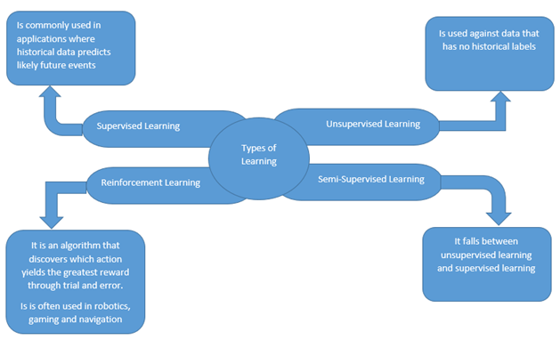

Supervised Learning:

Step 1: We train the machine with known data so that it learns something from it.
Step 2: Machine is exposed to an unknown data and is required to classify it based on the knowledge it had acquired in the first step.
Step 3: The model is evaluated on the basis of how accurately it has classified/predicted the unknown data.
This is called Supervised machine learning.

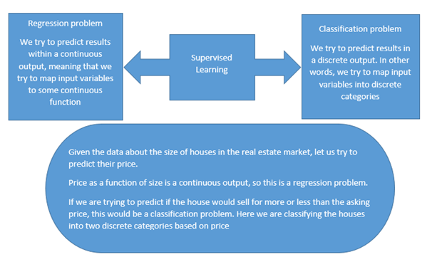

Unsupervised Learning:

Step1: We fix some variables or parameters based on which the machine will arrange the given data.
Step 2: The machine labels unknown data based on the decided variables or parameters
This is called Unsupervised Machine learning. Sometimes it is also called a Clustering.

Semi-Supervised Learning:

It falls between unsupervised and supervised learning.
In many practical scenarios, there is a large supply of unlabeled data but limited labeled data, which can be expensive to generate. Semi-supervised learning is a learning technique from a combination of both labeled and unlabeled data.
Step 1: Train a model with the labeled data alone.
Step 2: Use it to probabilistically classify the unlabeled data.
Step 3: Use ALL the data to train a new model.
Step 4: Iterate steps 2 and 3 till convergence.
Examples of semi-supervised learning are text processing, video-indexing, bioinformatics, web page classification, news classification.

Reinforcement Learning:

Reinforcement learning is learning how to map situations to actions so as to maximize a numerical reward signal. The learner is not told which actions are to be taken, as in the case with most forms of machine learning. The machine must discover which actions will yield the greatest reward by trying them.
In the most interesting and challenging cases, actions may affect not only the immediate reward but also the next situation and, through that, all subsequent rewards. These two characteristics- trial and error search and delayed reward are the two most important distinguishing features of reinforcement learning.
Reinforcement learning is defined not by characterizing learning methods, but by characterizing a learning problem. Any method that is well suited to solving that problem, is considered a reinforcement learning method.

Regression:

Regression analysis is a statistical process for estimating the relationships among variables. It includes many techniques for modeling and analyzing several variables, when the focus is on the relationship between a dependent variable and one or more independent variables (or 'predictors'). 
The regression model is represented using a mathematical model of form y= f(X), where y is the dependent variable and X is the set of predictor variables (x1, x2, …, xn).
In general, f(X) can take a linear form or a non-linear form.
Few of the linear models are as shown below.
•	f(X) = ß0 + ß1x1 + ß2x2 + ... + ßnxn + ∈
•	f(X) = ß0 + ß1x12 + ß2x1 + ∈
•	f(X) = ß0 + ß1x1p1 + ß2x2p2 + ... + ßnxnpn + ∈
Where,  ß0, ß1, ß2, ..., ßn are said to be the regression coefficients and ∈ accounts for the error in prediction. The regression coefficients and the error in prediction are real numbers.
If a linear regression model involves only one predictor variable and one dependent variable, it is called a Simple linear regression model.
E.g. f(X) = ß0 + ß1x1 + ∈
If a linear regression model involves multiple predictor variables and one dependent variable, it is called a Multiple linear regression model.
E.g. f(X) = ß0 + ß1x1 + ß2x2 + ... + ßnxn + ∈

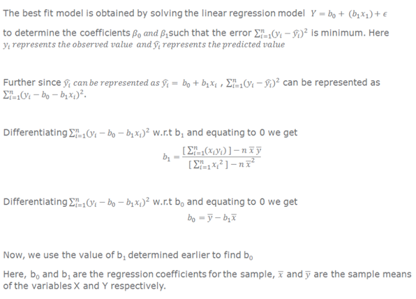

The usefulness of a linear regression model for a data set with an outcome variable Y and a predictor variable X, having a linear relationship modeled using simple linear regression  , where represents the errors (residuals),  can be determined using coefficient of determination (R2). The coefficient of determination is defined as:
 
 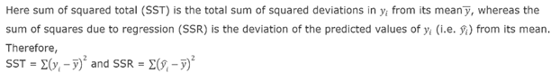
 
The sum of squared total (SST) can be thought of as the error in predicting Y without the knowledge of X. SST for linear regression is the same as the SSE obtained for the model, where Y is predicted as the mean of Y.

SST can also be expressed in terms of sum of squared regression (SSR) and sum of squared errors (SSE) as,
 
 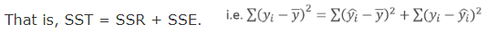
 
R2 can take values in the range 0 and 1. The higher the value of R2, the more useful is the model.

In a simple linear regression model, the dependent variable Y is related to a single predictor variable X. This simple linear regression model having the dependent variable Y can be described using  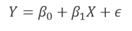

However, there may be more than one predictor variables available. For example:
1.	The volume of a tree trunk might be dependent on its height and girth. 
2.	The price of a house might be dependent on the number of bedrooms, the built-up area of the plot, the age of the house etc.
3.	The height of a child might be dependent on age, weight, heights of the parents etc.
In order to predict the dependent variable based on multiple predictors, we use a multiple linear regression model described as  

 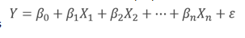

The regression coefficients  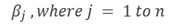    can be interpreted as the change in Y corresponding to a unit change in  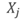 ,when all other predictor variables are held constant.

Determining strength of linearity of predictors
In a multiple regression model where two or more predictor variables are involved, it is possible that one predictor can be linearly predicted from the others, with a substantial degree of accuracy. In such a situation, the predictors are said to be highly correlated. In statistics, this phenomenon is called multicollinearity, or in other words collinearity. 
Due to collinearity, the coefficient estimates of the multiple regression may change erratically in response to small changes in the model or the data. But, for a linear regression model to be valid it is essential that the predictors of the model be linearly independent of each other.
The variables are suggested to be linearly dependent if the correlation values are close to 1. 
Hence, to determine the strength of linear relationship between the variables, correlation can be used.

Variable Inflation Factor

In addition to correlation, we shall use a measure called variance inflation factor(VIF) to determine if the predictor variables are independent of each other.
Variance inflation factor provides an extent of how much the variance of the estimated regression coefficients are inflated as compared to when the predictor variables are not related.
VIF is given as,

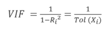
 
where, tolerance given as Tol(Xi)= 1-Ri^2  , represents the unexplained portion of the model and Ri^2 is the coefficient of determination when ith  independent variable is predicted by the other independent variables in the model.
For VIF values greater than 10 or for tolerance values less than 0.1 there seems to exist a collinearity problem.

Adjusted R-squared

Using the least squares method we try to establish a best fit linear regression model with minimum error. For a linear regression model every additional predictor variable tends to minimize the error of the model. As a result the R2 value will never decrease for any number of additional predictor variables being included in the model.
The R2 value can be inflated by including more and more predictor variables.
Thus the use of an additional statistic known as adjusted R2 is suggested. The adjusted R2 takes into account the number of predictor variables included in the regression model.
The adjusted R2 is defined as:   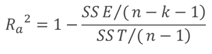

Where n is the number of observations and k is the number of number of predictor variables in the model. 

