Data Science
===

* The keyword in Data Science is not Data, it is Science.
* Businesses today are accumulating new data at a rate that exceeds their capacity to extract value from it. The question being faced by every organization is, how can data be used effectively – not just their own data, but all of the data that is available and relevant.
* Data Science is emerging at the intersection of fields of Probability & Statistics, Machine Learning, Computer Science and Mathematics. This specialized field demands multiple skills not easy to obtain through conventional curricula. 

Digital data
---

Methodical Alignment of Data points
---

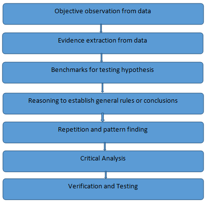

What is Data Science?
---
Data Science, a cross-functional discipline, is about scientific exploration of data to extract meaning or insight, and the construction of software systems to utilize such insights in a business or social context.

Components of Data Science
---

*	Apart from these, Domain knowledge must be acquired in order to apply Data Science effectively.

Probability
---

Probability is the branch of mathematics that deals with calculating the likelihood of a given event’s occurrence. It is expressed as a number between 0 and 1.
An event with a probability of 1 can be considered a certainty. An event with a probability of 0 can be considered as impossibility. The higher the probability of an event, the more certain we are that the event will occur.

Statistics
---

Statistics is a branch of mathematics concerned with collection, classification, analysis, and interpretation of numerical facts, for drawing inferences on the basis of their quantifiable likelihood (probability).

Linear Algebra
---

Linear Algebra is defined as the branch of mathematics that deals with the theory of systems of linear equations, matrices, vector spaces and linear transformations.

Why Linear Algebra?
---
*	Linear Algebra is critically used in almost all peripheries of science, practically solving most of the problems using linear models.
*	Most of the complex science problems are converted into problems of vectors and matrices and then solved with linear models.
*	In the world of data (especially, big data), linear algebra can be very handy to process huge chunks of data to accomplish many practical transformations such as graphical transformations, face morphing, object detection and tracking, audio and image compression, edge detection, blurring, and signal processing etc.

Linear Algebra in Data Science
---
*	In data science, while solving a given business problem, an appropriate statistical computing technique may be used.
*	These algorithms while working on the data, may either use iterative methods or linear algebra techniques for computation. 
*	Linear Algebra works as a computational engine for most of the data science problems because of its performance advantages over iterative methods.

Machine Learning
===
Field of study that gives computers the ability to learn without being explicitly programmed.

Supervised Learning
---

Step 1: We train the machine with known data so that it learns something from it.  
Step 2: Machine is exposed to an unknown data and is required to classify it based on the knowledge it had acquired in the first step.  
Step 3: The model is evaluated on the basis of how accurately it has classified/predicted the unknown data.  
This is called Supervised machine learning.

Unsupervised Learning
---

Step1: We fix some variables or parameters based on which the machine will arrange the given data.  
Step 2: The machine labels unknown data based on the decided variables or parameters  
This is called Unsupervised Machine learning. Sometimes it is also called a Clustering.  

Semi-Supervised Learning
---

It falls between unsupervised and supervised learning.  
In many practical scenarios, there is a large supply of unlabeled data but limited labeled data, which can be expensive to generate.   Semi-supervised learning is a learning technique from a combination of both labeled and unlabeled data.  
Step 1: Train a model with the labeled data alone.  
Step 2: Use it to probabilistically classify the unlabeled data.  
Step 3: Use ALL the data to train a new model.  
Step 4: Iterate steps 2 and 3 till convergence.  
Examples of semi-supervised learning are text processing, video-indexing, bioinformatics, web page classification, news classification.

Reinforcement Learning
---

* Reinforcement learning is learning how to map situations to actions so as to maximize a numerical reward signal. The learner is not told which actions are to be taken, as in the case with most forms of machine learning. The machine must discover which actions will yield the greatest reward by trying them.  
* In the most interesting and challenging cases, actions may affect not only the immediate reward but also the next situation and, through that, all subsequent rewards. These two characteristics- trial and error search and delayed reward are the two most important distinguishing features of reinforcement learning.  
* Reinforcement learning is defined not by characterizing learning methods, but by characterizing a learning problem. Any method that is well suited to solving that problem, is considered a reinforcement learning method.  

Supervised Learning
===
Regression
---

Regression analysis is a statistical process for estimating the relationships among variables. It includes many techniques for modeling and analyzing several variables, when the focus is on the relationship between a dependent variable and one or more independent variables (or 'predictors').  
The regression model is represented using a mathematical model of form y= f(X), where y is the dependent variable and X is the set of predictor variables (x1, x2, …, xn).  
In general, f(X) can take a linear form or a non-linear form.  
Few of the linear models are as shown below.  
*	f(X) = ß0 + ß1x1 + ß2x2 + ... + ßnxn + ∈
*	f(X) = ß0 + ß1x12 + ß2x1 + ∈
*	f(X) = ß0 + ß1x1p1 + ß2x2p2 + ... + ßnxnpn + ∈  
Where,  ß0, ß1, ß2, ..., ßn are said to be the regression coefficients and ∈ accounts for the error in prediction. The regression coefficients and the error in prediction are real numbers.  
If a linear regression model involves only one predictor variable and one dependent variable, it is called a Simple linear regression model.  
E.g. f(X) = ß0 + ß1x1 + ∈  
If a linear regression model involves multiple predictor variables and one dependent variable, it is called a Multiple linear regression model.  
E.g. f(X) = ß0 + ß1x1 + ß2x2 + ... + ßnxn + ∈  

The usefulness of a linear regression model for a data set with an outcome variable Y and a predictor variable X, having a linear relationship modeled using simple linear regression  , where represents the errors (residuals),  can be determined using coefficient of determination (R2). The coefficient of determination is defined as:
 
 
 
The sum of squared total (SST) can be thought of as the error in predicting Y without the knowledge of X. SST for linear regression is the same as the SSE obtained for the model, where Y is predicted as the mean of Y.

SST can also be expressed in terms of sum of squared regression (SSR) and sum of squared errors (SSE) as,
 
 
 
R2 can take values in the range 0 and 1. The higher the value of R2, the more useful is the model.  

In a simple linear regression model, the dependent variable Y is related to a single predictor variable X. This simple linear regression model having the dependent variable Y can be described using  

However, there may be more than one predictor variables available. For example:  
1.	The volume of a tree trunk might be dependent on its height and girth.   
2.	The price of a house might be dependent on the number of bedrooms, the built-up area of the plot, the age of the house etc.  
3.	The height of a child might be dependent on age, weight, heights of the parents etc.  
In order to predict the dependent variable based on multiple predictors, we use a multiple linear regression model described as  

 

The regression coefficients      can be interpreted as the change in Y corresponding to a unit change in   ,when all other predictor variables are held constant.

Determining strength of linearity of predictors
---
In a multiple regression model where two or more predictor variables are involved, it is possible that one predictor can be linearly predicted from the others, with a substantial degree of accuracy. In such a situation, the predictors are said to be highly correlated.  
In statistics, this phenomenon is called multicollinearity, or in other words collinearity.   
Due to collinearity, the coefficient estimates of the multiple regression may change erratically in response to small changes in the model or the data. But, for a linear regression model to be valid it is essential that the predictors of the model be linearly independent of each other.  
The variables are suggested to be linearly dependent if the correlation values are close to 1.   
Hence, to determine the strength of linear relationship between the variables, correlation can be used.

Variable Inflation Factor
---
In addition to correlation, we shall use a measure called variance inflation factor(VIF) to determine if the predictor variables are independent of each other.  
Variance inflation factor provides an extent of how much the variance of the estimated regression coefficients are inflated as compared to when the predictor variables are not related.  
VIF is given as,

 
where, tolerance given as Tol(Xi)= 1-Ri^2  , represents the unexplained portion of the model and Ri^2 is the coefficient of determination when ith  independent variable is predicted by the other independent variables in the model.  
For VIF values greater than 10 or for tolerance values less than 0.1 there seems to exist a collinearity problem.

Adjusted R-squared
---
Using the least squares method we try to establish a best fit linear regression model with minimum error. For a linear regression model every additional predictor variable tends to minimize the error of the model. As a result the R2 value will never decrease for any number of additional predictor variables being included in the model.  
The R2 value can be inflated by including more and more predictor variables.  
Thus the use of an additional statistic known as adjusted R2 is suggested. The adjusted R2 takes into account the number of predictor variables included in the regression model.  
The adjusted R2 is defined as:   

Where n is the number of observations and k is the number of number of predictor variables in the model. 

Classification
---

when predicting a category, the models built are referred to as classification models. The category of a new instance must be predicted based on the existing data. This can be done by finding patterns in the available data and then making a prediction based on the observed patterns.  
The categories of the data instances are referred to as class labels or classes. The attribute that holds these categorical values is called the class label attribute. The class of a new instance can be predicted by studying the patterns in the previously processed data. The attributes that are used in order to predict the value of the class label attribute are called the predictor attributes. 
Finally, the entire task of prediction of classes of new instances is termed as classification.   
For the purpose of classification one needs to move from historical data to a general model, known as the classifier. This classifier can be arrived at by analyzing patterns in the historical data, so as to classify new instances.  

Classification Algorithms
===
Logistic Regression
---

The logistic regression model is given as  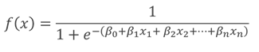

The figure below illustrates the prediction range of [0,1] for the logistic regression model as compared to the prediction range of 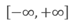 , for the linear regression model.

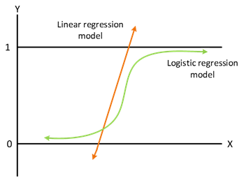
 
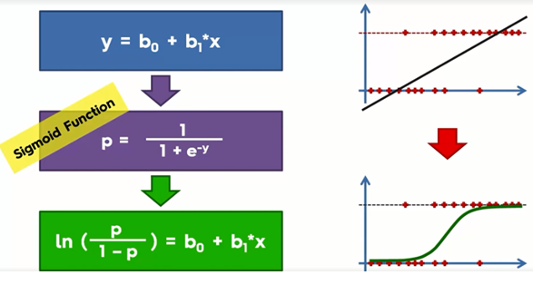

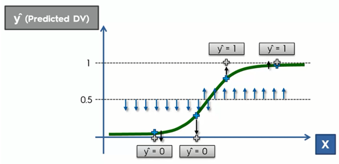

 
Anything below the halfway point (Depends on our selection) is projected onto y=0 i.e. category I and the points above are projected onto y=1 i.e. category II. That’s how classification happens.

K-Nearest Neighbors (K-NN)
---

 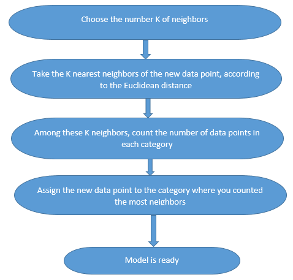
 
 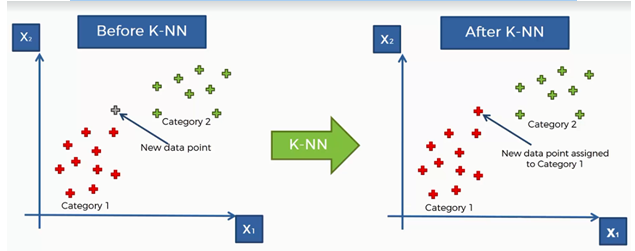
 
 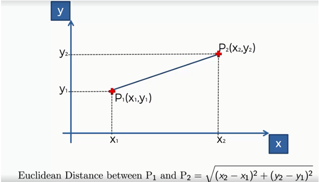
 

 

Support Vector Machine (SVM)
---
In SVM, the linearly separable data is classified by the Maximum Margin Classifier which is drawn equidistant from the support vectors representing the two categories.

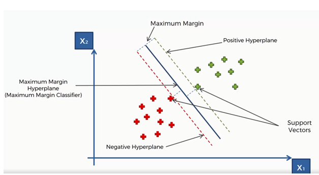
 
*	The Specialty of SVM model is its selection of Support vectors. 
*	The support vectors represent the most extreme or deviating characteristics in their corresponding categories. So when we are predicting the new data, we are comparing its characteristics with the support vector characteristics which are extreme. Thus the classification turns out to be more accurate.
*	This makes SVM model stand out from other classification models.

Kernel SVM
---
*	When the data is not linearly separable, it becomes difficult to classify the data with a boundary as shown below:
 
 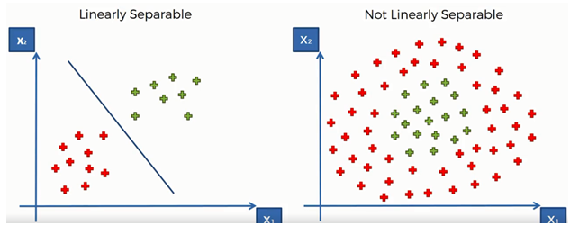

*	In such a case the Kernel SVM model maps the data to a higher dimension as shown :

Mapping to Higher Dimension
---
*	Consider a random data in one dimension which is not linearly separable.

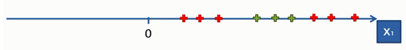
 
*	After modifying the equation as f=x-5 and subsequently f=(x-5)^2, the data gets transformed to a higher dimension. Then the data can be linearly separable as shown.
 
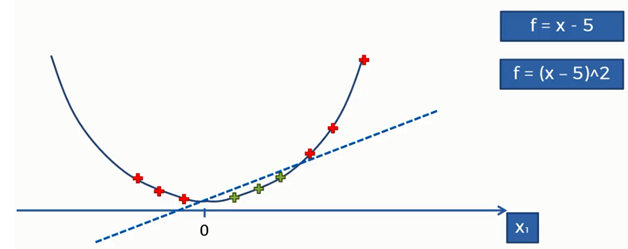

*	In the same way we can transform a 2-D data into 3-D data to separate the categories using the Mapping function by the kernel SVM model.

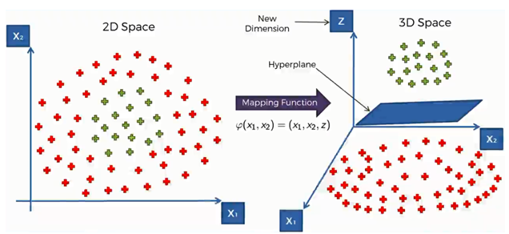

 
*	Later when we project this back to 2-D, we get our Nonlinear separator which classifies the two categories.

 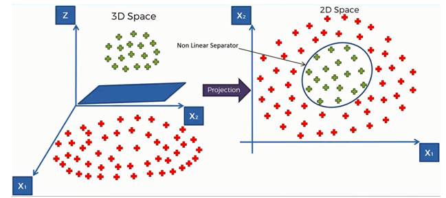

**Disadvantages**  
*	Mapping to higher dimensions can be highly compute-intensive.
*	The larger the dataset, the more is the processing power required.

**The Kernel Trick**  
In order to avoid the mapping to higher dimension we can use the kernel trick where we can use different types of kernels like Gaussian RBF kernel, Sigmoid Kernel, Polynomial Kernel etc.  
Let’s look into the Gaussian RBF Kernel.

**Gaussian RBF Kernel**

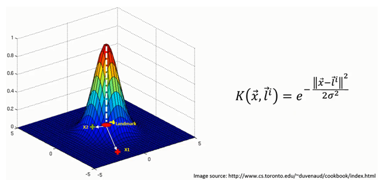

K-->Kernel
Li-->Landmark
x-->random point

*	When the random point X1 from the dataset is away from the landmark, then the exponential value converges to 0 and thus K=0.
*	When the random point X2 from the dataset is close to the landmark, then the exponential value converges to 1 and thus attaining the highest peak point in the Kernel i.e., K=1.

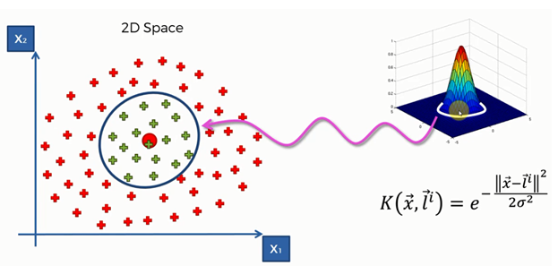

 
*	The Kernel SVM model will choose the optimum Landmark and sigma value using high level mathematics. 
*	The sigma value represents the circumference around the landmark. As the sigma value increases/decreases, the circumference increases/decreases.
*	If K>0 -->Green and if K=0 -->Red
*	Thus the classification happens without mapping to higher dimensions. 

Naïve Bayes
---
**Bayes theorem**
 
 
*	The formula can be better explained using an example:
*	Consider two machines M1 & M2 which produce Spanners and the spanners produced are embossed with the machine from which they came.
*	There are some defective spanners produced by both the machines. In order to find the probabilities of defective spanners from the machines we can use Bayes theorem as follows:

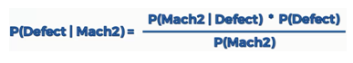

 
Here,  
P(Defect|Mach2)-->Probability that a spanner produced by machine M2 is defective.  
P(Mach2|Defect)-->Probability of defective parts that are produced by machine M2.  
Therefore, the Bayes theorem is used to classify the new data into corresponding category based on the probabilities i.e.,  
*	Let A and B be two categories and X is the new data which needs to be categorized using our Naïve Bayes model.
*	Firstly, we calculate the probabilities P(A|X) and P(B|X) where,

P(A|X)-->probability that the new data point belongs to category A given the features X of the data.  
P(B|X)-->probability that the new data point belongs to category B given the features X of the data.  
*	Thus if P(A|X) > P(B|X), then the new data point belongs to category A and vice versa.

**Why Naïve?**  
*	The algorithm is called naïve because of Independence Assumption.
*	Bayes theorem depends on these assumptions which may be wrong. But we should be clever enough to assume them to be correct, hence it is called Naïve Bayes.

Decision Tree Classification
---

 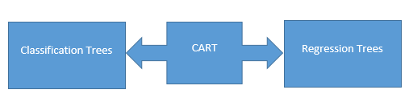

Here we will see about classification trees in order to classify our data.
*	The Decision Tree algorithm classifies the data using multiple splits as shown.
 
 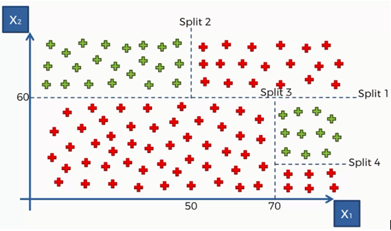
 
 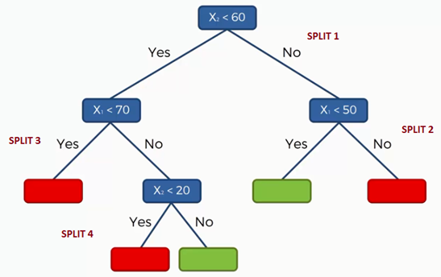
 
*	Based on the data, the algorithm splits the data and consequently builds a tree which decides the category of the new data point based on the tree.
*	This algorithm is old, simple and less powerful but is used along with other algorithms in useful applications like Facial Recognition, Kinect (Motion Sensing games).

Random Forest Classification
---

**Ensemble Learning**

The technique of integrating multiple machine learning algorithms to form a new bigger algorithm to solve our problem is called Ensemble Learning.
Random Forest algorithm is based on Ensemble learning where multiple Decision Trees are run on the data, making the algorithm very powerful and accurate.

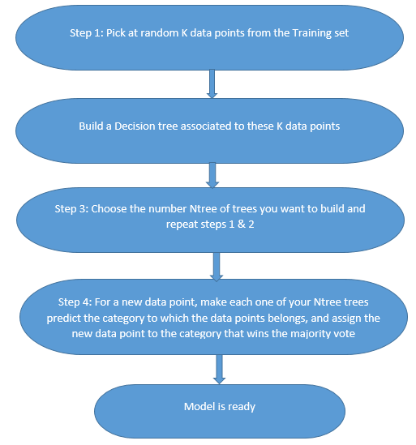
 

