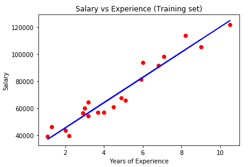
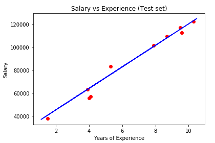
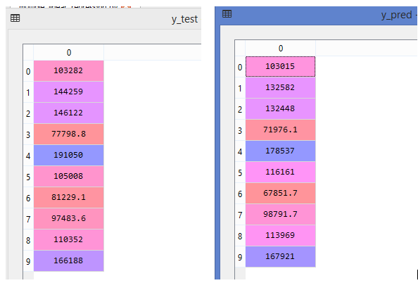
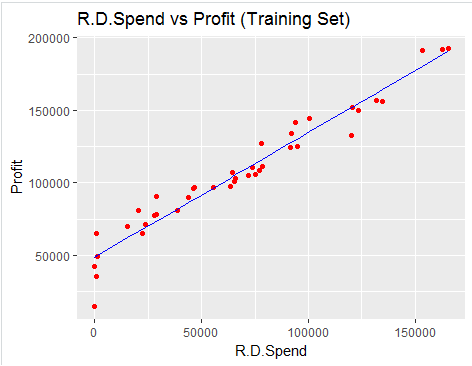
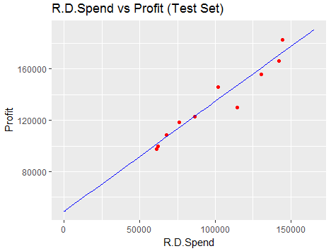

Regression
===
Simple Linear Regression
---

**Objective** : To predict the salary of a new recruit into the company based on his/her experience.  

**Dataset** : Salary_data.csv

**Independent variable**: Years of experience  

**Dependent variable**: Salary  

**Algorithm used**: Simple Linear Regression  

**Obervations**:

 

The above plot corresponds to our data points in the dataset and the blue line is the linear regressor which the algorithm has predicted.   

Now when we feed new data points (Years of Experience)into this model, the salary can be predicted by extending the point on X-axis ie., Years of Experience onto the regressor line. The corresponding value on the Y-axis will be our predicted salary.  

The below plot corresponds to the model response on the test set data where the red points are the actual salaries corresponding to experience. We can observe that most of the points are close to our regressor line which implies that our model has predicted the salaries with good accuracy.    

Multiple Linear Regression
---

**Objective** : To predict the profit of the Start-ups based on the various parameters that contribute to it.    

**Dataset** : 50_Startups.csv

**Independent variable**: R&D Spend, Administration, Marketing Spend & State  

**Dependent variable**: Profit    
 

**Algorithm used**: Multiple Linear Regression  

**Obervations**:

We can see that the predicted profits(y_pred) by our model are close enough to actual profits (y_test). Thus there is strong linear relationship between the independent and dependent variables.  

This model is not the optimal model as we are using all the independent variables for our prediction. There might be a case where some of the independent variables might not be statistically significant and do not contribute much compared to the significant variables. So, in order to eliminated such variables we use the Backward Elimination technique.  

After performing the Backward Elimination technique, we got R&D spent as the statistically significant variable ie., R&D spent contributes significantly to the profit of a startup and the contributions from other variables are minute and ignorable.  

Since we have only one independent variable after backward elimination, we can visualize the results.  

Thus we can see that our predictions of the profits are very close to the regressor line indicating a linear relationship.  
