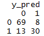
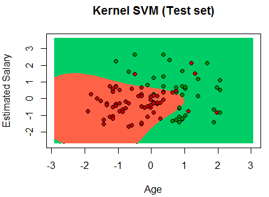

Classification Models
===

**Business problem**: The data given is of the users in a social network database. The social network has a number of clients among which a client has launched  a brand new Luxury SUV at a ridiculously low price and placed an advertisement in the social network. So the client wants to know about the users who showed interest on the advertisement and subsequently bought the car.
We have the User ID, Gender, Age, Estimated Salary of the users and also info whether they have bought the SUV or not.  

**Objective**: To design a machine learning model which classifies the users whether they will buy the SUV or not based on the parameters given about the user.  

**Dataset**: Social_Network_Ads.csv  

**Independent variable**: Estimated Salary  

**Dependent variable**:  Purchased  

**Algorithm**: ***Logistic Regression***  
---

**Observation**:

               

From the below visualization of the training set, we can see our model classifier categorizing the plot into areas which correspond to users who will buy the SUV and who will not buy the SUV.  

**Confusion Matrix**                      

**Summary**    

  

 **Accuracy = 99/120 = 82.5%**
 
 
 **ALgorithm** = ***K-NN***
 ---

**Observation**:

   
 
 **Confusion matrix**
 
 
 
 **Accuracy = 89/100 = 89%**
 
 
 
 **ALgorithm** = ***SVM***
 ---  
**Observation**:

      
 
 **Confusion matrix**
 
 
 
 **Summary**  
 
 
 
 **Accuracy = 80/100 = 80%**
 
 
 
 
 
 **ALgorithm** = ***Kernel SVM*** 
 ---  
 **Observation**:  
 
      
 
 **Confusion matrix**
 
 
 
 **Summary**  
 
  
 
 **Accuracy = 90/100 = 90%**
 
 
 
 
 **ALgorithm** = ***Naive Bayes***
 ---  
 **Observation**:  
 
   
 
 **Confusion matrix**
 
 
 
 **Accuracy = 107/120 = 89.16%**
 
 
 **ALgorithm** = ***Decision Tree***
 ---  
 **Observation**:  
 
  
 
 **Confusion matrix**
 
 
 
 **Accuracy = 83/100 = 83%**
 
 
 **ALgorithm** = ***Random Forest***
 ---  
 **Observation**:  
  
 
 **Confusion matrix**
 
 
 
 **Accuracy = 85/100 = 85%**
 
